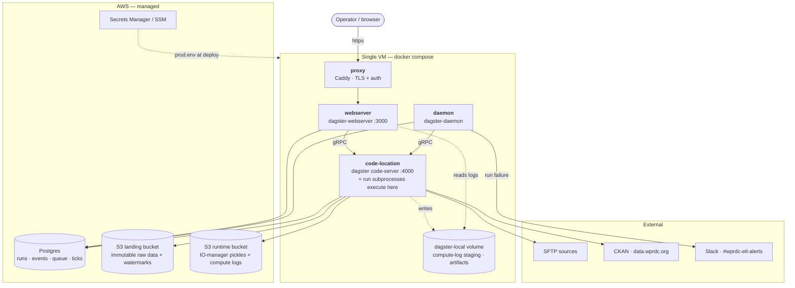
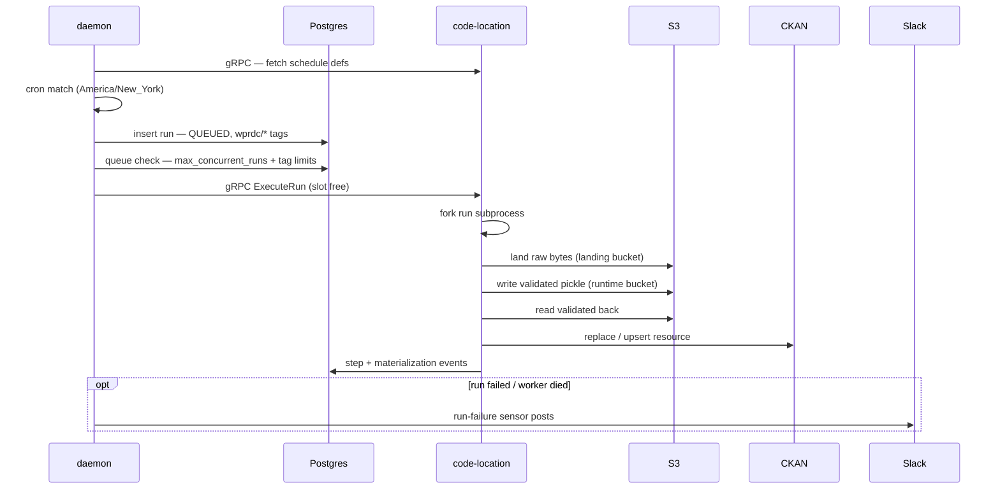

# Deployment

Production runs on a **single VM** with `docker compose`: three Dagster
processes from one image, plus a Caddy reverse proxy. State lives in **managed
Postgres** and **AWS S3**; secrets come from **Secrets Manager / SSM**.

The step-by-step rollout (infra provisioning, sequencing, cutover) lives in the
deploy plan; this README is the architecture reference.

## Architecture



Everything left of the `aws` box is one `docker compose` stack. `code-location`,
`daemon`, and `webserver` are the **same image** (built from the repo
`Dockerfile`) running different commands; `proxy` is stock `caddy:2`.

## Services

| Service | Command | Role |
|---|---|---|
| **code-location** | `dagster code-server start -m wprdc_etl.definitions` | The only process that imports the pipeline code. Serves the definitions over gRPC **and** hosts the run subprocesses (`DefaultRunLauncher` forks them here). Sized for `DAGSTER_MAX_CONCURRENT_RUNS` concurrent jobs + one `heavy` outlier. |
| **daemon** | `dagster-daemon run` | The clock and dispatcher: evaluates schedules/sensors, drains the run queue (`QueuedRunCoordinator` + `tag_concurrency_limits`), monitors for dead runs, fires the Slack run-failure sensor. Stateless — all working state is in Postgres. **Without it, nothing fires.** |
| **webserver** | `dagster-webserver -w workspace.yaml` | UI + GraphQL. Read-mostly (run history, logs, asset status from Postgres); can launch runs on demand. Auth-less itself — never exposed directly. |
| **proxy** | `caddy:2` | TLS termination + authentication. The only publicly reachable container; reverse-proxies to `webserver:3000`. |
| **Postgres** *(managed)* | — | Two databases on one instance. `dagster`: run storage, event logs, schedule/sensor ticks, the run queue — the coordination backbone for all three Dagster services (`DAGSTER_PG_URL`). `spatial`: the PostGIS admin-region store backing `reverse_geocode` (`SPATIAL_DSN`), needs `CREATE EXTENSION postgis`. |
| **S3** *(AWS)* | — | `landing` bucket: immutable raw source + watermarks. `runtime` bucket: the `validated → loaded` IO-manager pickles and step compute logs. |

`webserver` and `daemon` reach `code-location` via `prod/workspace.yaml`
(`grpc_server: code-location:4000`) — they never import the pipeline code
in-process.

## Run lifecycle (scheduled)



A UI-triggered run is identical from the `insert run — QUEUED` step onward:
operator → Caddy (auth) → webserver → GraphQL → queued run in Postgres.

## Files

| Path | What |
|---|---|
| `../Dockerfile` | The one app image (`uv sync --no-dev`; migrate-then-exec entrypoint) |
| `entrypoint.sh` | Runs `dagster instance migrate`, then execs the service command |
| `prod/dagster.yaml` | Production Dagster instance config — coordinator, S3 compute logs, run monitoring, retention. Copied to `$DAGSTER_HOME`; **not** the repo-root dev `dagster.yaml` |
| `prod/workspace.yaml` | Points webserver + daemon at the gRPC code server |
| `compose.prod.yaml` | The stack. **Template** — set `WPRDC_ETL_IMAGE`, the domain, the secrets path |
| `Caddyfile` | Proxy TLS + basic-auth. **Template** — set the domain and password hash, or swap for oauth2-proxy |
| `s3-lifecycle.json` | Landing-bucket lifecycle (IA at 90d, Glacier at 365d) — `aws s3api put-bucket-lifecycle-configuration` |

## First boot

Prerequisites (provisioned separately): managed Postgres + `dagster` database;
the two S3 buckets with policy/IAM; the VM's IAM instance role (S3 R/W +
`secretsmanager:GetSecretValue`); secrets written to `/opt/wprdc-etl/prod.env`
(0600) by the deploy step.

Plus the spatial store, on the same managed instance — one extra database and
one extension (RDS and Cloud SQL both ship PostGIS):

```sql
CREATE DATABASE spatial;
\connect spatial
CREATE EXTENSION postgis;
```

Set `SPATIAL_DSN` to it. The tables are created on first write by
`SpatialResource.ensure_schema()`, and populated by materializing the
`*/boundaries/*` jobs once — nothing to seed by hand. Until those run,
`reverse_geocode` fails loud naming the layers it can't find, so bring the
boundary layers up before any dataset that depends on them.

```bash
export WPRDC_ETL_IMAGE=ghcr.io/<org>/wprdc-etl@sha256:...
docker compose -f deploy/compose.prod.yaml pull
docker compose -f deploy/compose.prod.yaml up -d
```

The entrypoint runs `dagster instance migrate` on every start (idempotent) —
re-run a deploy after any `dagster` version bump. Verify with a **dry run**
(`ENVIRONMENT` unset in `prod.env`) before flipping `ENVIRONMENT=production`.
